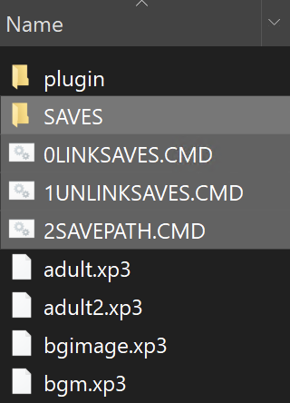

# game-saves-linker
Game saves linker for galgames (and other games).

Galgame（或者其他游戏的）游戏存档链接器

## What does it do?

Just as the repo name implies, it will link you games' saves to your custom location (instead of some random default paths of your game).

Some games store their saves in a default path (and you cannot change it). But, who wants their precious saves stored in C: drive where you cannot even find them. I cannot resume my game if I am on a new machine. What's more, if you forgot to back them up and did a fresh install of Windows, and now you are SCREWED!

Using directory symbolic links, this script solves this problem by making the game believe that it is saving to the default path, but instead, the saves are written to you custom location (currently in `SAVES` folder that is along side this script; will allow custom locations if there is a need).

正如名字所说，它会把你游戏存档链接到你自定义的地方（而不是游戏莫名其妙的默认路径）。

有些游戏会把它们的存档放在默认路径里（而且你不能改！），但是谁会想把我的珍贵存档放在 C 盘一个我根本找不到的地方呢？这样我换台机器就不能继续我的游戏了。而且万一你忘了备份，然后全新安装了 Windows ，那你就没了！

这个脚本就是为了解决这个问题的，用目录符号链接来让你的游戏误以为它把存档放在了默认位置，而实际上它已经在你想要的位置了（目前在脚本旁边的 `SAVES` 文件夹；以后会支持自定义文件夹）。

## How to use it?

This script will link your games' default saves directory to `.\SAVES` (alongside where you put these scripts).

Typically, you will put these scripts within your games' installation directory (for galgames), so that all saves are also alongside your game. Also, you will store your game to somewhere you have all your galgames backed up, so you can easily find your saves and resume where you left off on a different machine.

1. Copy these three files `0LINKSAVES.CMD`, `1UNLINKSAVES.CMD`, and `2SAVEPATH.CMD` to your games' installation directory.

2. Open and edit `2SAVEPATH.CMD`. You need to specify the default save location of your game, otherwise I have no idea where to link your saves. See the example for Riddle Joker inside this file.

   ```batch
   REM Echo the default save path of the game like this,
   REM **without** the backslash at the end,
   REM which will be linked to .\SAVES
   REM You can use environment variables to make this more dynamic (just like the example below).
   ECHO %USERPROFILE%\AppData\Roaming\YuzuSoft\RiddleJoker
   ```

3. **IMPORTANT:** Back up your current saves to a safe location before doing this step! Since they will be replaced with symbolic links.

   Now you have backed up your saves. Double click `0LINKSAVES.CMD` (possibly with administrator privileges) to link `.\SAVES` to the default location of your game.

   Now your game directory will look like this, will these 4 highlighted items:

   

4. Move your saves that you just backed up to `.\SAVES`. Now your saves are in their new locations, and your game will work as before.

5. Although you probably do not need to do this, to remove the linked directory, run `1UNLINKSAVES.CMD`. (Relax, your saves in `.\SAVES` will not be affected.)

Effect:

In the example above, your saves are originally stored in `%USERPROFILE%\AppData\Roaming\YuzuSoft\RiddleJoker`. Now it is in `.\SAVES` (inside the installation directory of your game).

When the game tries to access `%USERPROFILE%\AppData\Roaming\YuzuSoft\RiddleJoker`, it is actually accessing `.\SAVES`. So even if you moved your saves, your game will continue to work.

这个脚本会将你的游戏的默认存档位置链接到 `.\SAVES` ，也就是你放脚本的地方的 `SAVES` 文件夹里。

一般来说，你会把这些脚本放在游戏安装目录下面（比如 Galgame），这样你的所有存档就在你的游戏安装目录里了。而且你也会把你的游戏放在你放所有 galgame 备份的地方，这样就方便你找到并备份存档了，你也能很轻易地在新机器上继续玩之前的存档。

1. 复制这些脚本 `0LINKSAVES.CMD`, `1UNLINKSAVES.CMD` 和 `2SAVEPATH.CMD` 到你的游戏的安装目录下。

2. 编辑 `2SAVEPATH.CMD` ，你需要指定你的游戏的默认存档路径，不然我不知道怎么链接过去。可以看看样例， Riddle Joker 是怎么设置的。

   ```batch
   REM 像这样 echo 你游戏的默认存档位置，它会被链接到 .\SAVES
   REM 末尾 **不要** 加上反斜杠
   REM 你可以用环境变量来进行更加灵活的配置（例如下面的例子）
   ECHO %USERPROFILE%\AppData\Roaming\YuzuSoft\RiddleJoker
   ```

   

3. **注意：**请先备份你现在的存档到一个安全的位置再继续！因为它们会被换成符号链接。

   好了你现在备份好存档了。双击 `0LINKSAVES.CMD` （可能需要管理员权限）来链接 `.\SAVES` 到你游戏的默认位置。

   现在你的游戏目录会看起来像这样，多了这 4 个高亮的项目：

   

4. 把你刚刚备份的存档移动到 `.\SAVES` 。现在你的存档就在新的位置了，同时你的游戏也能正常工作。

5. 尽管你一般不需要删除链接的目录，如果你需要的话运行 `1UNLINKSAVES.CMD` 即可。（放心，你在 `.\SAVES` 里面的存档不会被删除。）

效果：

在上面的样例里，你的存档原先在 `%USERPROFILE%\AppData\Roaming\YuzuSoft\RiddleJoker` ，但是现在在你游戏安装目录下的 `SAVES` 文件夹了。

当你的游戏尝试访问 `%USERPROFILE%\AppData\Roaming\YuzuSoft\RiddleJoker` 的时候，它其实在访问 `.\SAVES` 。这样的话即便你已经移动了存档位置，你的游戏也会正常工作。

## FAQ

1. Q: Why there is 0, 1, 2 in the file name?

   A: This is intentionally added to make sure it is on top so that you can easily find it, otherwise you need to scan through a lot of files (especially in a games' installation directory where there are a TON of files).

2. Q: Can it support custom save paths instead of `.\SAVES`?

   A: Currently no, but it is easy to support this feature. You can implement it yourself, or I will add this feature at a later time.
